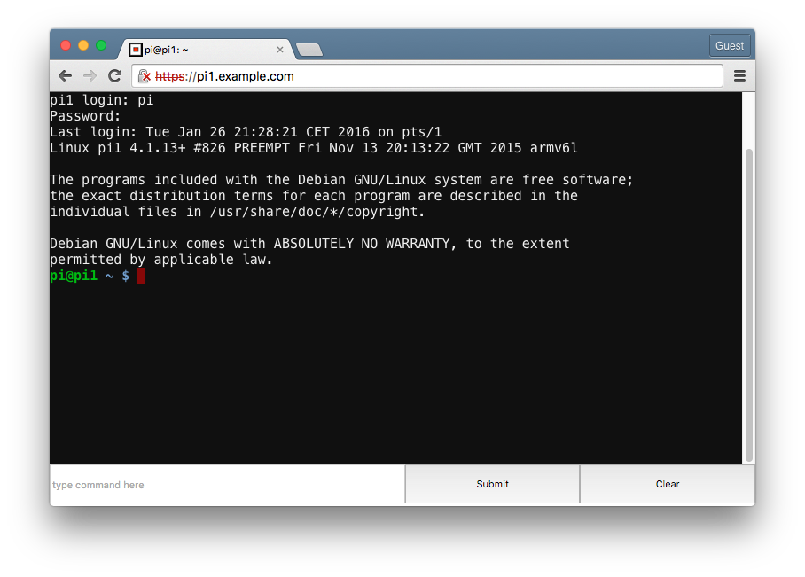

[](http://standardjs.com/)

# WebLogin
### Remote UNIX login via web-browser (Firefox or Chrome) 
Does not require any plugin or browser extension.



### Install Node.js
Download and install latest Node.js binary package from https://nodejs.org/dist/latest/
```
e.g. as root:
tar xf node-v*.tar.gz 
mv node-v*.tar.gz /usr/local/node
export PATH=$PATH:/usr/local/node/bin
```

### Install WebLogin
```
git clone https://nuc.example.com/git/morjan/weblogin.git
cd weblogin
npm install
```

### create a self signed certificate
```
npm run certs
```

### create an http-auth password file
```
npm run passwd <username>
```

## start the WebLogin server
```
npm start
```

### connect from your browser
```
https://<username>@<your server ip>
```

### how to rebuild hterm_all.js (optional)
```
git clone https://chromium.googlesource.com/apps/libapps
cd libapps
LIBDOT_SEARCH_PATH=$PWD ./libdot/bin/concat.sh -i ./hterm/concat/hterm_all.concat -o public/hterm_all.js
```

